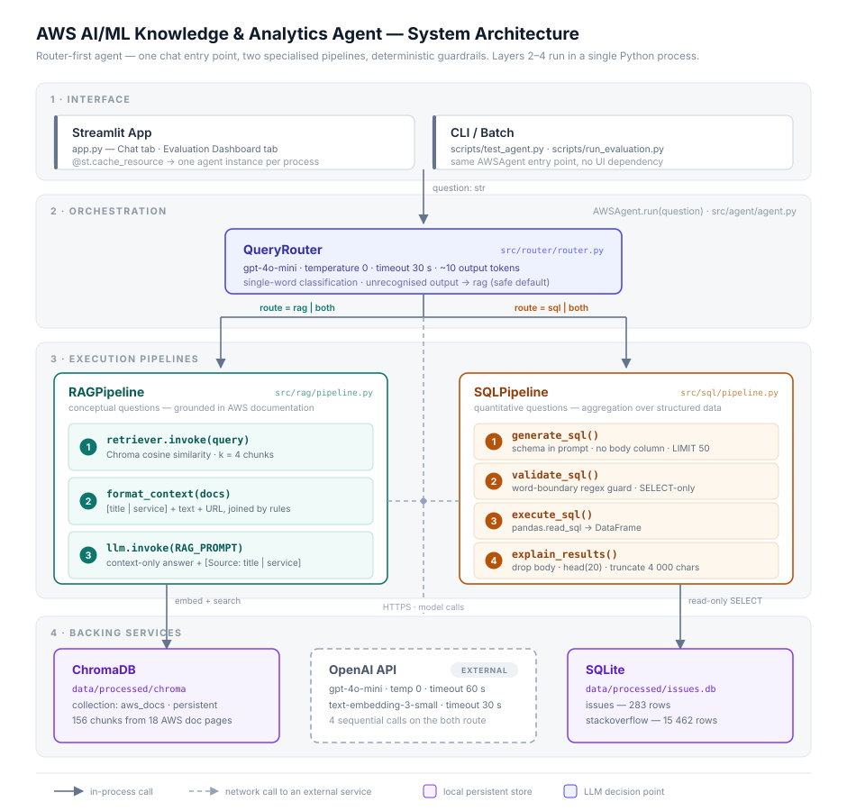
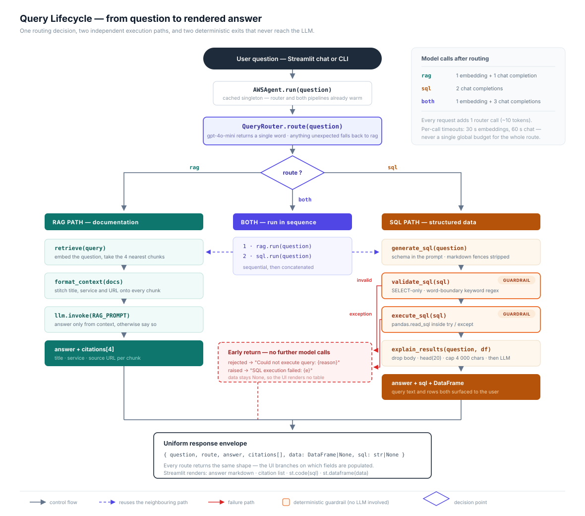
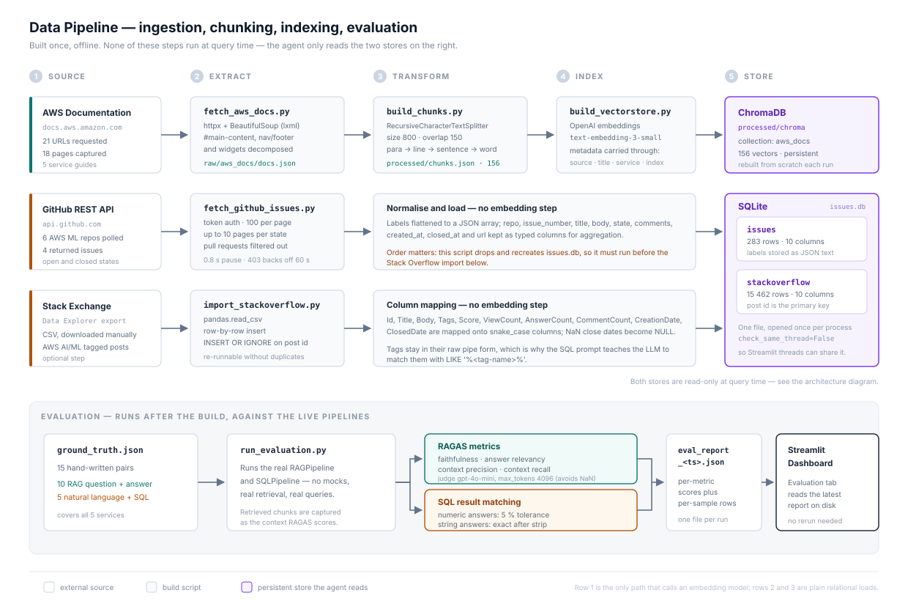

# AWS AI/ML Knowledge & Analytics Agent

A **supervisor multi-agent system** that answers conceptual questions ("How does SageMaker training work?"), data questions ("Which repo has the most open issues?"), and the questions that are both — from one chat box, across a conversation.

One structured planning call per turn decides which specialists run, whether they can run at once, and **what each of them is asked**. Three correction loops sit behind that, each with a ceiling, each built for a failure the evaluation harness actually produced — and one of them stops and puts a query to the person using the app.

Built on LangGraph. Every claim about it below has a number behind it, and the harness that produced the number runs the agent itself rather than the pipelines underneath it.

---

## What this solves, and why it is a multi-agent graph

### The problem

Two kinds of question arrive in the same box, and they need incompatible machinery.

*"How does SageMaker Model Monitor detect data drift?"* is answered by prose that someone already wrote. You find it by meaning — embed the question, retrieve the nearest passages, generate from them.

*"Which repo has the most open issues?"* is answered by a number that exists nowhere until it is computed. There is no passage to retrieve. You need an aggregate over rows.

A vector search cannot count. A `GROUP BY` cannot explain. And the questions people actually ask do not respect the boundary:

> *"Which service has the most unanswered questions, and what does it do?"*

That one cannot even be **split in advance**, because the thing to look up in the documentation is the answer to the query. The two halves are ordered, and the order is a fact about the question rather than a preference.

So the problem is not "build a RAG bot". It is: given one question, decide what kind of work it needs, get the right sources involved in the right order, ask each of them the right thing — and be able to tell whether that decision was correct, on questions nobody has hand-checked.

### Why not the two simpler shapes

**One LLM with both the context and the schema.** It conflates two reasoning patterns and does both worse. Worse for this project: there is one call and one output, so there is no decision to observe. When it answers the wrong question you find out from a user, not from a metric.

**A router and two pipelines.** This is the honest baseline, it is still in the tree (`AGENT_IMPL=v1`), and every number below is measured against it. Its ceiling is structural: a classification can only say **who**. Three things it cannot say each turned out to be a real, measured defect —

| What a router cannot express | What it cost | Fixed by |
|---|---|---|
| that one specialist needs the other's answer first | order accuracy 87%, answer relevancy 0.487 — the retriever was searching a compound sentence that appears in no document | `mode: sequential`, and a refine step |
| what each specialist is being asked | SQL accuracy 60% — a count arriving with the documentation half attached came back filtered by it: 541 rows for an answer of 1,840 | one plan carrying `{agent, query}` per specialist |
| what to do when a specialist finds nothing | adversarial SQL 60% — `tags LIKE '%<bedrock>%'` is valid SQL against a tag written `<amazon-bedrock>`, so it returns zero, and the zero was reported as the answer | a repair loop that treats "found nothing" as a failure signal |

The graph is not architecture for its own sake. Every node and every edge in it is there because the simpler shape produced a wrong answer somebody can point at.

### What the multi-agent shape buys

1. **Decomposition — each specialist answers a question it can actually answer.** Splitting a two-part question raised SQL accuracy 60% → 90% and *lowered* cost (3.73 → 3.63 calls per query, p50 3.21s → 2.93s), because a query that was never going to work no longer pays a repair call to be rescued.
2. **Ordering as a first-class decision.** Answer relevancy 0.487 → 0.699 and order accuracy 87% → 100%, for 0.56 of a call per query.
3. **Correction while it can still change the answer.** The loops are evaluation metrics moved out of the offline report and into the request path. An offline score tells you last night's answers were ungrounded; a loop can do something about tonight's. Adversarial SQL 60% → 100%, and it only fires on failure, so a query that works costs nothing extra.
4. **The decision is an object, so it can be scored.** Delegation accuracy and order accuracy exist only because "who runs, and in what relation" is an explicit, loggable plan rather than a branch inside a prompt. This is the property that compounds: v1's two-specialist route carried a correctness bug for the entire life of the project because nothing in the harness could see the decision to check it.
5. **Every part is separately switchable, so its cost is measurable — and two of the three loops were switched off.** Grading and criticism cost 2.2 extra calls per query and 1.36s of p50 latency to move faithfulness by 0.006, inside the judge's noise, while losing 0.114 of answer relevancy. They stay in the tree behind a flag. Being able to *cut* a component on evidence is worth as much as being able to add one.
6. **There is a specific place to put a human.** Not a blanket "approve this SQL" dialog, which teaches people to click through it, but an `interrupt()` at the two decisions the code genuinely cannot make: a query the reviewer cannot classify, and a query the repairer rewrote rather than the one the question produced.
7. **Conversation state is explicit about what carries.** Exactly one channel survives a turn; every other one is reset by name. Resolving a follow-up is also *cheaper* than not resolving it — 3.20 calls per turn against 3.40 — because an unresolved question produces a query for a service nobody named, which returns zero and spends a repair call.

**What it costs, stated plainly:** 0.76 more LLM calls per question than v1 (2.87 → 3.63) and 0.38s more p50 latency, for a system with more moving parts to understand. The argument is not that the extra calls are free. It is that they are counted, attributed, and reported next to the quality they bought — which is how two of the three loops came to be removed.

### Where this shape transfers

Nothing in the graph's control flow — dispatch, parallel fan-in, the loops and their ceilings, the checkpointing, the human gate — knows what AWS is. The domain lives in the prompts and in the two pipelines; the only executable line that knows the schema is the repairer's list of columns worth probing. The same structure fits anywhere the same problem shape appears: **prose and numbers, in one question, with an audience that needs the answer to be right.**

- **Internal "ask the company" assistant** — the wiki and the design docs on one side, the data warehouse on the other, and questions like "how many teams adopted this service last quarter, and what does the migration guide say to do first?"
- **Customer support** — product documentation plus the customer's own account data. The human gate moves to the obvious place: before any write, refund, or entitlement change.
- **On-call and observability** — runbooks as the documentation specialist, metric and log queries as the data specialist. The sequential mode is the common case: find the failing service first, then look up what to do about it.
- **Finance, BI and compliance** — filings, policy text and contracts alongside the numbers they are about, where an answer that cites the wrong half is worse than no answer.

Extending it is bounded work rather than a rewrite:

- **A third specialist** is a node, an entry in the plan schema, and a paragraph in the planning prompt. The obvious one here is already named under [Known gaps](#known-gaps) — the AWS documentation corpus contains nothing about `aws-neuron/aws-neuron-sdk`, so the honest answer to "what is that project for?" is currently silence; a repository-README or code-search specialist closes it.
- **Swapping the stores** touches the two pipelines and nothing else: any retriever for Chroma, a warehouse for SQLite.
- **Production multi-user** needs a durable checkpointer in place of the in-process one, and query results stored as rows rather than pickled.
- **The evaluation harness is the part worth stealing.** Delegation accuracy, order accuracy, per-question call and token cost, and the with-history / no-history ablation are all domain-independent. They are what turn "the agent seems better" into a number that can lose.

---

## Architecture

<p align="center">
  
</p>

Layers 2–4 run inside one Python process; the only network dependency at query time is the OpenAI API. Each of the three gaps in the table above is a node or an edge in this diagram.

**Data sources:**
- AWS documentation (SageMaker, Bedrock, Rekognition, Comprehend, Lambda) — 18 pages, 156 chunks
- GitHub Issues from `autogluon/autogluon`, `aws-neuron/aws-neuron-sdk`, `aws/sagemaker-python-sdk`, `aws/amazon-sagemaker-examples` — 283 issues
- 15,462 Stack Overflow questions tagged with AWS AI/ML services

### Turn lifecycle

How one question travels through the graph — the plan, the two specialists, the loops, the one place it stops for a person, and the envelope that comes out.

<p align="center">
  
</p>

### Data pipeline

Everything on the top half is built **once, offline**. No ingestion, chunking or embedding happens at query time — the agent only reads the two stores on the right. The bottom half is the evaluation, which runs after the build and goes through the agent rather than around it.

<p align="center">
  
</p>

---

## Tech Stack

| Layer | Tool |
|-------|------|
| Graph orchestration | LangGraph (`StateGraph`, `Command`, `interrupt`, `MemorySaver`) |
| LLM | OpenAI `gpt-4o-mini` |
| Embeddings | OpenAI `text-embedding-3-small` |
| Vector store | ChromaDB (local, persistent) |
| Relational DB | SQLite (read-only at query time) |
| LLM primitives | `langchain-core`, `langchain-openai`, `langchain-chroma` |
| UI | Streamlit |
| Evaluation | RAGAS, plus a delegation/cost harness written for this project |
| Data ingestion | httpx, BeautifulSoup, GitHub REST API |

---

## Getting Started

### 1. Install dependencies

```bash
conda create -n aws-ai-agent python=3.11
conda activate aws-ai-agent
pip install -r requirements.txt
```

`requirements.txt` holds `langchain-core` at 0.3.x on purpose, and says why at the top of the file: `ragas` still hard-imports a `langchain-community` module that the core 1.x line removed. `scripts/verify_langgraph_support.py` proves the pin costs nothing — it checks every graph capability this project uses against the pinned version, and makes no API calls.

### 2. Configure environment

```bash
cp .env.example .env
# Fill in: OPENAI_API_KEY, GITHUB_TOKEN
```

`LANGSMITH_API_KEY` and `LANGSMITH_TRACING=true` are optional; set them to trace turns.

### 3. Build the data pipeline (one-time setup)

```bash
python scripts/fetch_aws_docs.py        # scrape AWS documentation
python scripts/build_chunks.py          # chunk it
python scripts/build_vectorstore.py     # embed into Chroma (calls the OpenAI API)

python scripts/fetch_github_issues.py   # drops and recreates issues.db — run before the import below
python scripts/import_stackoverflow.py  # optional; needs a Stack Exchange Data Explorer CSV first
```

### 4. Run

```bash
streamlit run app.py            # the graph, with memory and the SQL gate on
python scripts/test_agent.py    # v1 from the CLI
```

Two environment variables change what the app runs:

| Variable | Default | Effect |
|---|---|---|
| `AGENT_IMPL` | `graph` | `v1` runs the linear router-and-two-pipelines baseline instead |
| `CONFIRM_SQL` | `1` | `0` runs generated SQL without stopping to ask |

### 5. Run tests

```bash
pytest tests -v      # 126 tests, no API calls
```

---

## Project Structure

```
aws-ai-agent/
├── app.py                    # Streamlit — Chat (streamed) + Evaluation Dashboard
├── src/
│   ├── graph/                # the shipped agent
│   │   ├── builder.py        #   StateGraph wiring + the GraphAgent facade
│   │   ├── state.py          #   AgentState, and the findings channel that merges
│   │   ├── nodes.py          #   supervisor / prefetch / rag / sql / synthesize / critic / remember
│   │   ├── supervisor.py     #   who runs, in what relation, and what each is asked
│   │   ├── synthesizer.py    #   cross-specialist merge, and the critic's redraft
│   │   ├── repair.py         #   rewrites a failed query from the failure and real values
│   │   ├── grader.py         #   retrieval relevance check + query rewrite
│   │   ├── critic.py         #   groundedness gate before the answer ships
│   │   └── narrate.py        #   one node update -> one line for the UI, and which
│   │                         #   tokens are the answer rather than working notes
│   ├── tags.py               # marks the one model call per turn that writes prose
│   ├── rag/pipeline.py       # retrieve + generate
│   ├── sql/pipeline.py       # text-to-SQL + execute + explain
│   ├── sql/validate.py       # allow / confirm / reject for generated SQL
│   ├── router/router.py      # v1 — LLM intent classification
│   └── agent/agent.py        # v1 — AWSAgent, the linear baseline
├── scripts/
│   ├── fetch_aws_docs.py · build_chunks.py · build_vectorstore.py
│   ├── fetch_github_issues.py · import_stackoverflow.py
│   ├── run_evaluation.py     # 30 single-turn samples, through the agent
│   ├── run_multiturn_eval.py # 10 two-turn conversations, with and without history
│   ├── compare_v1_v2.py      # structural parity against the real stack
│   ├── measure_loops.py      # SQL repair loop — recovery rate vs v1
│   └── verify_langgraph_support.py
├── tests/
│   ├── test_pipelines.py     # pipelines and the SQL reviewer
│   ├── test_graph.py         # topology, dispatch, the loops, multi-turn, the gate
│   └── test_multiturn_eval.py# the multi-turn harness scores what it claims to
├── assets/                   # the three diagrams above
├── data/
│   ├── raw/                  # scraped docs, raw CSVs
│   └── processed/            # Chroma, issues.db, chunks.json, ground truth, reports
└── .streamlit/config.toml
```

---

## Example Queries

| Plan | Example |
|-------|---------|
| `rag` alone | "What is Amazon Bedrock and how does it differ from SageMaker?" |
| `sql` alone | "Which repo has the most open GitHub issues?" |
| two, parallel | "What are the most common SageMaker issues, and how does training work?" |
| two, sequential | "Which service has the most unanswered questions, and what does it do?" |
| a follow-up | "And Rekognition?" · "What about 2024?" · "How does it handle long documents?" |

---

## Technical Design Decisions

Each of these is a real trade-off with a failure behind it, not a default choice.

---

### 1. A supervisor that plans, not a router that classifies

**Decision:** one structured call per turn returns `tasks: [{agent, query}]` and a `mode`, replacing the earlier `QueryRouter`, which returned one of three words.

**Why a plan rather than a classification.** The router could express *who* runs and nothing else. Three things it could not say turned out to matter:

- **Ordering.** "Which service has the most questions and what does it do?" needs the database queried before the documentation can be searched, because the thing to search for is the query's answer. v1 sent the raw question to the retriever, which searched a string that appears in no document.
- **What each specialist is asked.** See the next section — this was worth 30 points of SQL accuracy.
- **What the question refers to.** On a follow-up, the same call also rewrites "how many questions are tagged with it" into a question that stands on its own.

**Why structured output rather than parsing text.** `QueryRouter` mapped any unrecognised reply to RAG through `route_map.get(raw, RouteType.RAG)` — a statistics question silently reaching a pipeline that cannot count. `with_structured_output` returns a validated object, so that fallback has no work left to do. The fallback still exists one level up: if the call raises or returns nothing usable, the plan degrades to rag alone on the whole question. RAG is the safer default because it says it lacks the information rather than inventing a query.

**Why not a ReAct agent with tools?** More flexible, harder to debug, and it obscures which specialist ran — which is precisely the thing the evaluation needed to measure. A plan is one object you can log, assert on, and score against a label.

---

### 2. The plan says what each specialist is asked, not just who runs

**Decision:** `Plan.tasks` carries a query per specialist. `AgentState` carries `agent_queries: dict[str, str]` rather than one shared question.

**The bug.** Before this, both specialists were handed the same string. "How many questions are tagged SageMaker, and how does training work in it" reached the data specialist whole and became:

```sql
WHERE tags LIKE '%<amazon-sagemaker>%'
  AND (title LIKE '%training%' OR body LIKE '%training%')
```

541 rows for a question whose answer is 1,840. Not a missing number — a wrong one. The mirror image also happened: a resolved question that named all four repositories looked self-sufficient, so the supervisor decided SQL alone could answer it and dropped the documentation half. The answer still described the project, from the model's own knowledge, with nothing retrieved behind it.

Deciding who runs and deciding what each one is asked is one decision, so it is one call.

**Three judgement calls inside it:**

- **One specialist is asked the question unchanged.** There is nothing to split, and a paraphrase can quietly drop a constraint like "in 2023". Keeping the rewrite only where it does work also bounds the change to the two-specialist routes that were broken.
- **A half that comes back empty degrades to the whole question**, in one place (`_effective_query`), which is the pre-split behaviour.
- **Sequential refinement rewrites that specialist's own half**, not the whole question. The other half has already been answered by the finding being fed in; handing back the whole question invites the rewrite to ask for it twice.

`agent_queries` is a plain channel rather than a reducer because the supervisor is its only writer — but it has to be a dict, because under parallel fan-out both nodes read the same state snapshot and one channel cannot hold two different questions.

**The first version of the prompt cost 40 points of delegation accuracy.** Written with the split up front and every example a decomposition, the model started adding a documentation specialist to plain counting questions so it would have something to split: delegation fell 90% → 50%. The fix was not more rules but their order — choosing the specialists is its own section and comes first; splitting is a second section that only applies once two have been chosen; and the negative cases are stated outright. Same model, same rules, 40 points of accuracy in the arrangement.

---

### 3. Three loops, each with a ceiling — and only one of them ships

**Decision:** the graph contains three cycles. Two are off by default.

| Loop | Fires when | Ceiling | Shipped |
|---|---|---|---|
| `rag → rag` | the grader says the documents cannot answer the question | 2 retrievals per dispatch | off |
| `sql → sql` | the query errors, is rejected, or finds nothing | 2 attempts per dispatch | **on** |
| `critic → synthesize` | a claim is not traceable to the evidence | 1 redraft per turn | off |

Every one of them has a ceiling because a cycle without one is a hang. The per-specialist budgets are reset on each dispatch, so a re-dispatch gets a fresh allowance while `passes` bounds the outer supervisor loop.

**Why the SQL loop earns its place.** Asked how many Bedrock questions exist, the model writes `tags LIKE '%<bedrock>%'`. The real tag is `<amazon-bedrock>`, so the query is valid SQL that returns zero rows — and v1 reported the zero as the answer. Two things follow. Finding nothing is a failure signal, not an answer, so `looks_empty()` treats a single-cell `COUNT` of zero as finding nothing — a plain "no rows" check misses exactly the case the loop was built for. And the repair has to see real values, not the schema again: no amount of re-reading a column description reveals that tags are written `<amazon-bedrock>`, so the repair prompt carries sample values from the column the failed query touched. The prompt is also told, in as many words, that zero is sometimes the true answer and a filter must not be widened to make a number non-zero.

**Why the other two do not ship.** Measured: together they add 2.2 LLM calls per query and 1.36s of p50 latency to move faithfulness by 0.006 — inside the judge's noise band — while *losing* 0.114 of answer relevancy, because the critic trims claims it cannot tie to a source and on this question set it trims useful ones. They stay in the tree behind `loops="all"`; a differently shaped question set could justify them, this one does not.

---

### 4. Three verdicts for generated SQL, and a human for the middle one

**Decision:** classify a generated query `allow` / `confirm` / `reject` (`src/sql/validate.py`) after stripping comments and string literals, rather than sweeping the raw text once for six keywords and answering yes or no.

**The bugs this fixes, all four measured against the previous check:**

```
SELECT COUNT(*) ... WHERE title LIKE '%delete endpoint%'    was rejected
SELECT repo, COUNT(*) ... WHERE body LIKE '%create model%'  was rejected
WITH t AS (SELECT ...) SELECT * FROM t                      was rejected
SELECT * FROM issues LIMIT 50; SELECT * FROM stackoverflow   was allowed
```

The word-boundary regex distinguished `CREATE TABLE` from `created_at`, which was the bug it was written for, but it could not distinguish a keyword from the same letters inside a string literal — and "how do I delete a SageMaker endpoint" is this app's own subject matter. It also had no concept of a statement, so `WITH … SELECT` was not a SELECT and two statements were one.

**Why three verdicts:** the queries that are neither clearly a read nor clearly a write are a real category — `EXPLAIN SELECT …`, or a query whose quoting does not close so the checker cannot read it at all. A binary check has to guess, and guessing wrong is either a blocked legitimate question or an unreviewed query reaching the database. `confirm` says what is actually true: the code cannot decide this one.

**Who answers a `confirm`:** the person using the app. `SQLPipeline.validate_sql` still returns a pair for callers that have nobody to ask — v1, and the evaluation harness — and there the middle tier collapses to *no*, because an unanswerable question is not a licence to proceed. With `CONFIRM_SQL` on, the graph parks the query, shows it, and waits (`interrupt()`). A rejection is never put to a human: approving a query the reviewer refuses is not a decision anyone should be offered — a `reject` goes back to the repair loop instead.

**The other thing a human is asked about:** a repaired query. The repair loop rewrites the query after the first one came back empty, and its prompt has to be told not to widen a filter just to turn a zero into a number — exactly the mistake a person catches in one look at the SQL. Ordinary queries are not gated; a blanket confirmation on a read-only database is friction that teaches people to click through it.

**Why the pause takes a second pass through the node.** `interrupt()` replays its node from the top when the answer arrives, so it has to be the first thing that happens in the node. Otherwise resuming would re-run the LLM call that produced the query, and the app could show one query for approval while executing another.

**Why not a full SQL parser?** `sqlglot` or `sqlparse` would be more robust, and remains the right move if the tiers ever need to reason about what a query touches rather than what kind of statement it is. Literal-stripping plus statement-splitting is ~60 lines with no dependency and closes the cases that were actually failing.

**Scope:** still not a security firewall — the database is a read-only local file and the system is not public-facing. The middle tier is what that admission looks like in code rather than in a paragraph.

---

### 5. What the checkpointer carries, and what it must not

**Decision:** compiling with a checkpointer makes the whole state survive a turn. Exactly one channel should. `GraphAgent._turn_input()` explicitly clears every other one.

With a checkpointer and no reset, the graph would resume mid-turn rather than start a new one: `passes` already at its ceiling would send the question straight to synthesis, and last turn's `findings` would be answered again. `findings` needs an explicit `None` rather than `[]`, because writing an empty list to an accumulating channel appends nothing — it does not clear. That is why `merge_findings` is a hand-written reducer instead of `operator.add`: a plain add channel has no way to express a reset.

`history` is the one channel deliberately left to carry. It stores **what the user typed**, not the supervisor's rewrite of it — feeding the supervisor back its own rewrites would let one bad resolution fix itself into the record. `remember` is a separate node on the graph's single exit rather than a write from `synthesize`, because synthesis can run twice in a turn when the critic rejects a draft, and a history write there would file both drafts as if the user had asked twice.

**One bug this found before it produced a single number.** Every channel is written to the checkpoint at every superstep, `data` holds a DataFrame, and msgpack cannot encode one. With `memory=True` — the only configuration the Streamlit app runs — every question that reached SQL raised `Type is not msgpack serializable: DataFrame`. The graph tests never saw it because their fake SQL pipeline returns lists. Fixed by giving the in-process saver `pickle_fallback=True`, which keeps the msgpack path for every channel that can take it. That is sound because this saver lives and dies with the process; a durable checkpointer should store the result as rows instead.

---

### 6. Showing the work: one streamed node update, one line

**Decision:** `src/graph/narrate.py` maps a streamed `(node, update)` pair to at most one sentence, and the chat renders them as the turn happens.

The dispatch decision, a retry, a repair and a redraft all happen before there is an answer to show. Until they were streamed, all of it went to stdout, where nobody using the app could see it — and a spinner is the one display guaranteed to hide the only thing that makes this more interesting than a single pipeline call.

Returning `None` matters as much as the strings. The supervisor is woken once per specialist and parks the early wake-ups; `remember` files the turn; the critic produces no verdict when it never ran. Narrating any of those would show a step the user cannot make sense of, or — worse — claim an answer was checked when nothing checked it.

It lives in `src/graph/` rather than `app.py` so it can be tested without starting Streamlit. The mapping is where the mistakes are, and the mistakes are silent: a wrong branch shows a plausible sentence about work that never happened.

---

### 7. Chunking strategy: structure-aware over fixed-size

**Decision:** `RecursiveCharacterTextSplitter` with `chunk_size=800`, `chunk_overlap=150`, separator priority `["\n\n", "\n", ". ", " ", ""]`.

AWS documentation uses headers, numbered steps and definition blocks. Fixed-size splitting cuts mid-sentence or mid-step, producing chunks that lack self-contained meaning — the retriever finds them but the LLM cannot generate a useful answer from them. The splitter tries each separator in order, falling back only when the resulting chunk would exceed `chunk_size`: paragraph, line, sentence, word.

800 characters (~200 tokens) is large enough to hold a complete concept while staying well within the embedding model's budget. The 150-character overlap (~1–2 sentences) prevents losing context at a boundary — a retrieval miss caused by a concept spanning two chunks is a silent failure that is hard to debug.

---

### 8. Two-layer token budget for SQL results

**Problem discovered in testing:** the `explain_results` call sent 257,911 tokens in a single request, hitting the 200,000 TPM rate limit. The `issues` table has a `body` column with full issue text, and `df.to_string()` dumped all of it into the prompt.

**Decision:** two independent enforcement layers.

1. **Prompt layer** — the SQL generation prompt says "NEVER select the 'body' column" and "always add LIMIT 50". Prevents the problem at the source.
2. **Code layer** — `explain_results` drops `body` from any DataFrame before serialization, caps at 20 rows, and hard-limits the result string to 4,000 characters.

The prompt layer can be ignored by the LLM; it is a request, not a constraint. The code layer is deterministic and always executes. The prompt reduces the frequency; the code makes it impossible to exceed the limit regardless of what the model does.

The same reasoning appears again in `Synthesizer.strip_placeholder_citations`. The RAG prompt tells the model to always cite; when retrieval turns up nothing relevant it complies anyway and emits the format string itself, which then survives synthesis as a citation to nothing. The synthesis prompt asks for these to be dropped, and the code strips them regardless.

---

### 9. Per-call timeouts, not global

**Decision:** `timeout=60` on generation calls, `timeout=30` on embeddings and on the short structured calls (planning, grading, critique), set at each `ChatOpenAI` / `OpenAIEmbeddings` constructor.

A two-specialist turn makes four to six sequential API calls. A 60-second global timeout would fire after the first two complete, killing the SQL specialist mid-execution. Per-call timeouts give each operation its own budget. Embedding calls are fast in practice (<2s), so 30s catches a genuine network hang without over-waiting; generation is more variable, so 60s allows a complex response while preventing indefinite blocking.

---

### 10. Direct `langchain_core` imports over the `langchain` shim

**Decision:** import `ChatPromptTemplate` from `langchain_core.prompts` and `Document` from `langchain_core.documents` — not from `langchain.prompts` or `langchain.schema`.

With `langchain-core >= 1.0` the `langchain` package re-exports classes through a lazy `__getattr__` shim, and several re-export paths — including `PipelinePromptTemplate` and `BaseMemory` — were removed in core 1.x. Importing through `langchain.*` triggers the broken shim even when you never use the removed classes, producing an `ImportError` at module load. Importing directly from `langchain_core.*` bypasses it, is forward-compatible, and is semantically correct about where the dependency lives.

---

### 11. One agent per process, one thread per conversation

**Decision:** `AWSAgent`/`GraphAgent` construction is wrapped in `@st.cache_resource`; the conversation identity lives in a `thread_id` in `st.session_state`.

Streamlit re-runs the whole script on every interaction. Without caching, each query would re-initialize the agent — three `ChatOpenAI` clients, Chroma loaded from disk, a SQLite connection — adding 1–3s per query and cycling file handles for no reason. `@st.cache_resource` initializes once per server process, matching the lifecycle of a connection pool or a loaded model in a production service.

That caching is what makes the thread id necessary. One cached agent means **one checkpointer shared by every browser session**, so without a per-session thread id two users would be continuing each other's conversation. "New conversation" drops the transcript and the thread together: dropping only the transcript would leave the agent resolving "it" against turns the user can no longer see.

---

## Evaluation

The harness runs whichever implementation is asked for and scores what comes out of it. That is worth stating plainly: the earlier version called `RAGPipeline` and `SQLPipeline` directly, so routing, dispatch and every loop were invisible to it — the two-specialist route carried a correctness bug for the whole life of the project without a single number touching it.

```bash
python scripts/run_evaluation.py --version v1          # AWSAgent, the linear baseline
python scripts/run_evaluation.py --version v2-repair   # the shipped configuration
python scripts/run_evaluation.py --version v2-flat     # graph, no quality loops
python scripts/run_evaluation.py --version v2          # graph, every loop on
python scripts/run_evaluation.py --skip-ragas          # agent and SQL metrics only, no judge calls
```

Reports land in `data/processed/eval_report_<timestamp>_<version>.json` and the Streamlit **Evaluation Dashboard** tab renders the latest.

### The question set

30 samples: 10 documentation, 10 analytical (5 of them adversarial), 10 requiring both. Each carries `expected_agents` and `expected_order`, which is what makes delegation measurable.

Two things about it are deliberate. The original 15-sample set scored between 0.91 and 1.00 on every metric with a run-to-run spread of 0.05 — no room for an improvement to register. And it contained **zero** two-specialist samples, so the one route with a known bug had never been evaluated at all.

The adversarial subset exists because of a specific failure: asked how many Bedrock questions exist, the model writes `tags LIKE '%<bedrock>%'`. The tag is really `<amazon-bedrock>`, so the query is valid SQL that finds nothing, and the nothing gets reported as the answer.

### Results

30 samples, one run each. RAGAS uses an LLM judge, so treat differences under about 0.05 as noise.

| | v1 linear | no loops | repair only | all loops | **+ split** |
|---|---|---|---|---|---|
| Faithfulness | 0.820 | 0.808 | 0.848 | 0.854 | **0.797** |
| Answer relevancy | 0.487 | 0.699 | 0.724 | 0.610 | **0.780** |
| Context precision | 0.529 | 0.529 | 0.479 | 0.454 | **0.542** |
| Context recall | 0.596 | 0.537 | 0.562 | 0.596 | **0.621** |
| SQL accuracy | 45% | 45% | 60% | 55% | **90%** |
| SQL, adversarial subset | 60% | 60% | 100% | 100% | **100%** |
| Delegation accuracy | 100% | 100% | 100% | 100% | **100%** |
| Order accuracy | 87% | 100% | 100% | 100% | **100%** |
| LLM calls per query | 2.87 | 3.43 | 3.73 | 5.93 | **3.63** |
| p50 latency | 2.55s | 2.92s | 3.21s | 4.57s | **2.93s** |

The last column is the shipped configuration: SQL repair only, plus the per-specialist split from decision 2.

*The SQL accuracy row compares strings ignoring case in every column.* The original comparison was exact, which scored a query returning `SageMaker` against a hand-written label of `sagemaker` as wrong — it was measuring the label's capitalisation, not the answer. Every column is recomputed from its own stored `sql_details`, so the change did not improve a number by moving the line: under exact comparison the same runs read 40%, 40%, 55%, 55% and 85%. The stored reports predate the fix, which is why the dashboard shows 85% for the run this table reads 90% from.

**What the supervisor bought.** Answer relevancy 0.487 → 0.699 and order accuracy 87% → 100%, for 0.56 of a call per query. Both come from the same fix: v1 sent the raw question to both specialists, so for "which repo has the most open issues, and what is that repo for?" the retriever searched a string that appears in no document. The supervisor runs the analytics half first and rewrites the query from what came back.

**What the SQL repair loop bought.** The adversarial subset from 60% to 100%, and overall SQL accuracy from 45% to 60%, for 0.3 of a call per query — it only fires on failure, so a query that works costs nothing extra.

**What the split bought.** SQL accuracy 60% → 90%, and it is *cheaper*: 3.73 → 3.63 calls per query, p50 3.21s → 2.93s, with the repair loop firing 2 times instead of 6. Both come from the same place. Nine of the thirty questions have two parts, and each one used to reach the data specialist with the documentation half still attached — a filter nobody asked for, narrowing the result to zero or to a wrong number, and then paying a repair call to rescue a query that was never going to work. Retrieval improved for the mirror-image reason: the documentation specialist now searches its own clause instead of a compound sentence, which is context precision 0.479 → 0.542 and recall 0.562 → 0.621. Faithfulness moved 0.848 → 0.797, the one number that went the wrong way; it is at the edge of the ±0.05 judge band on a single run, and answers now carry more retrieved material to be unfaithful to, so it is the number to watch on the next set rather than a result.

**What the grader and the critic cost.** 2.2 extra calls per query and 1.36s of p50 latency, to move faithfulness by 0.006 — inside the noise — while *losing* 0.114 of answer relevancy. They are off by default and stay behind `loops="all"`.

**One bug the harness caught.** The critic originally judged answers against retrieved documents alone. On a two-specialist route the factual core often comes from the query result, so it rejected a correct "aws-neuron/aws-neuron-sdk has 79 open issues" for not appearing in any AWS document, and the redraft replaced it with "I cannot answer". Faithfulness rose to 0.927 because the answer no longer claimed anything; answer relevancy collapsed to 0.498 for the same reason. The critic's evidence now includes query results.

### Metrics

**RAGAS** — faithfulness (are the answer's claims supported by the sources?), answer relevancy (does it answer the question asked?), context precision (is the retrieved material useful and well ranked?), context recall (was everything the reference answer needs retrieved?).

**Delegation accuracy** — did the right specialists run? **Order accuracy** — where one depends on the other, did they run in the right order?

**Cost** — LLM calls, tokens and p50 latency per query, reported alongside quality because a version that wins by making twice as many calls should have to say so. Tokens are counted separately from calls because carrying a conversation forward grows the prompt without changing the call count.

---

## The second turn

Multi-turn shipped without anything measuring it. The failure mode is quiet: the supervisor rewrites "how many questions are tagged with it" into a standalone question, and if it resolves `it` to the wrong service the graph still dispatches, still queries, still answers — it answers a different question. Route-level metrics cannot see that, because the route is `sql` either way.

```bash
python scripts/run_multiturn_eval.py                        # both conditions
python scripts/run_multiturn_eval.py --condition with-history
python scripts/run_multiturn_eval.py --judge                # + LLM equivalence check
```

10 two-turn conversations. The second turn refers back by pronoun, by ellipsis ("And Rekognition?", "What about 2024?"), by ordinal ("the second one"), or to something only the *assistant* said — and in two of them it refers back to nothing at all, because a supervisor that resolves everything is its own failure. Each second turn carries `expected_standalone`, `expected_agents`, `expected_order`, required and forbidden mentions, and ground-truth SQL where there is a number to check.

The whole set runs twice: `with-history` plays both turns on one thread, `no-history` plays the follow-up alone on a fresh one. The second condition is the ablation, and it is also exactly what every version before multi-turn did with a follow-up.

| | no history | with history |
|---|---|---|
| Resolution | 20% | **100%** |
| — follow-ups that refer back (8) | 0% | **100%** |
| — follow-ups that do not (2) | 100% | 100% |
| Over-resolution | 0% | 0% |
| Delegation accuracy | 90% | **100%** |
| Order accuracy | 90% | **100%** |
| Answer contains what was asked for | 60% | **100%** |
| SQL value correct (7 labelled) | 29% | **100%** |
| Judge: equivalent to the labelled rewrite | 60% | **100%** |
| LLM calls per turn | 3.40 | 3.20 |
| Tokens per turn | 2,284 | 2,187 |
| Seconds per turn | 3.49 | 4.45 |

Resolution is scored by required and forbidden mentions rather than by string equality with the labelled rewrite: there are many correct rewrites of "And Rekognition?" and only one of them is the one a human wrote down. The labelled rewrite feeds `--judge`, which agrees with the deterministic score on 16 of the 20 rows. All four disagreements are no-history rows whose "rewrite" still contains the pronoun: the judge reads "how does it stop harmful content from reaching users" as equivalent to the labelled rewrite, because it resolves the reference itself while scoring. That is why the LLM verdict is reported beside the score and not as it — a judge that can do the task it is grading will credit work that never happened.

**Resolution costs less than not resolving.** The follow-up prompt is bigger, yet the with-history condition makes *fewer* calls (3.20 vs 3.40) and spends *fewer* tokens per turn (2,187 vs 2,284). An unresolved question produces a query for a service nobody named, that query returns zero, and the SQL repair loop fires — a call spent recovering from a question that was never going to work. It is slower per turn (4.45s vs 3.49s), and that is the same story from the other side: the resolved turns dispatch the two specialists a two-part question needs, where the unresolved ones dispatch one and answer the wrong question quickly. The 24 calls and 18k tokens the setup turns cost are the conversation itself, not overhead.

### What the multi-turn harness found

Two failures that look unrelated and are the same missing decision — the plan named the specialists but not what each of them was being asked. Both are described under [decision 2](#2-the-plan-says-what-each-specialist-is-asked-not-just-who-runs); this is what fixing them did.

| with history | before the split | after |
|---|---|---|
| Delegation accuracy | 90% | **100%** |
| Order accuracy | 90% | **100%** |
| SQL value correct (7 labelled) | 86% | **100%** |
| Resolution / answer / judge | 100% | 100% |
| LLM calls per turn | 3.00 | 3.20 |
| Tokens per turn | 1,601 | 2,187 |

All ten second turns now pass every check. The extra 0.2 calls are the second specialist the sequential case should always have dispatched; the extra tokens are the larger planning prompt, and they buy the two numbers above. The no-history column is unchanged — which matters, because this change is not multi-turn code. `PLAN_PROMPT` is what a first turn uses too, so it was re-measured on the single-turn set: SQL accuracy 60% → 90% there, at 3.63 calls per query instead of 3.73. Multi-turn is where the bug became visible, not where it lived.

The split is shown in the app too — *Splitting it — data: …; documentation: …* — since a clause sent to the wrong specialist is invisible until the number comes back wrong.

---

## Tests

126 tests. All of them cover pure functions or fake collaborators, and none makes an API call:

```bash
pytest tests -v
```

| Test group | What it verifies |
|------------|-----------------|
| `validate.review` | Keywords inside string literals are not keywords; CTEs are reads; two statements are refused; what cannot be read is asked about, not guessed |
| `explain_results` | Body column stripped before the prompt; DataFrame capped at 20 rows |
| `format_context` | Content, title, service, URL present; multiple docs separated |
| `router` | v1 maps rag/sql/both correctly; unknown output falls back to RAG |
| v1/v2 parity | Single-specialist routes stay field-for-field identical to `AWSAgent` |
| planning | One specialist is asked the question whole; a repeated or unusable plan is normalised; a failed planning call still returns a dispatchable plan |
| the split | Each specialist is asked its own half; a plan with no split, or with half of one, still asks the whole question; sequential refinement rewrites that specialist's half |
| dispatch | Parallel fan-out really overlaps; a slow branch is not dropped when a fast one wakes the supervisor |
| the loops | Each terminates on its own budget; repair fires on a COUNT of zero; the critic sees query results, not just documents |
| multi-turn | `history` crosses a turn boundary and nothing else does; threads do not see each other; a query result survives the checkpointer |
| narration | Every branch says what actually happened, and says nothing where nothing happened |
| the gate | Nothing reaches the database before it is approved; resuming does not regenerate the query; a rejection is never put to a person |
| the multi-turn harness | Resolution scoring is blind to wording and not to the subject; the ablation is what moves the number, not the harness |

---

## Known gaps

- **The documentation corpus does not cover the GitHub projects it can now be asked about.** The split made "which of them has the most open issues, and what is that project for?" dispatch the documentation specialist correctly, and there is nothing in the AWS documentation about `aws-neuron/aws-neuron-sdk`. The answer no longer invents a description — it just does not answer that half. The right source is the repository's README, which is not in the corpus.
- **Faithfulness moved the wrong way on the last run** (0.848 → 0.797), inside the judge's noise band on a single run. It is the number to watch on the next question set.
- **The screenshots in `assets/` are from the v1 app** and are not linked above; they show the concatenated two-part answer the synthesizer replaced, and a report selector the dashboard no longer has. They need retaking.
- **The checkpointer is in-process.** Conversations do not survive a restart, and `pickle_fallback` is only sound because the saver lives and dies with the process. A durable checkpointer should store query results as rows instead of pickling a DataFrame.
