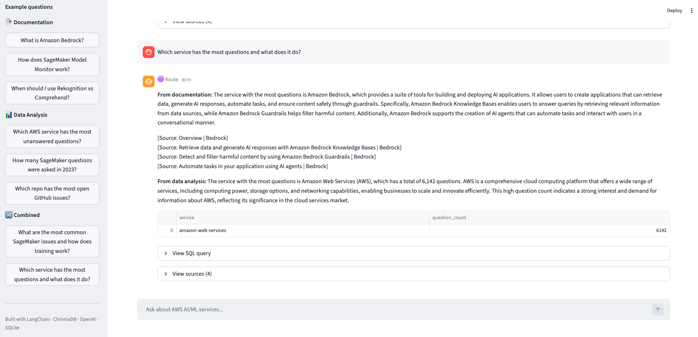
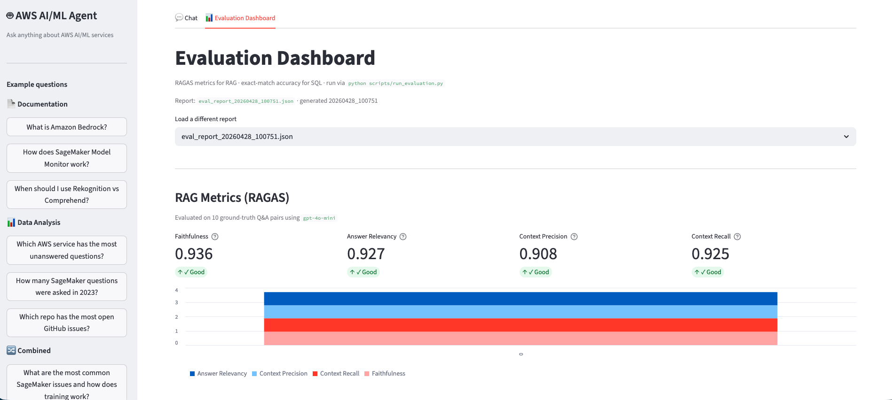

# AWS AI/ML Knowledge & Analytics Agent

**Production-grade AI Knowledge + Analytics Agent** — a system that combines RAG, Text-to-SQL, and an LLM-based router to answer both conceptual questions ("How does SageMaker training work?") and data-driven questions ("Which repo has the most open issues?") from a single chat interface.

Built to demonstrate how LangChain primitives compose into a real, decision-making agent — not just a chatbot wrapper.

---

## Architecture

```
User Question
      │
      ▼
┌─────────────┐
│ QueryRouter │  gpt-4o-mini classifies intent → rag / sql / both
└──────┬──────┘
       │
   ┌───┴────────────────────┐
   │                        │
   ▼                        ▼
┌────────────┐     ┌────────────────┐
│ RAGPipeline│     │  SQLPipeline   │
│            │     │                │
│ Chroma DB  │     │  SQLite DB     │
│ (156 chunks│     │  283 GitHub    │
│  AWS docs) │     │  issues +      │
│            │     │  15,462 SO     │
│ OpenAI     │     │  questions     │
│ Embeddings │     │                │
│ gpt-4o-mini│     │  gpt-4o-mini   │
└─────┬──────┘     └───────┬────────┘
      │                    │
      └─────────┬──────────┘
                ▼
         Combined Answer
         + Citations / SQL / Data Table
```

**Data sources:**
- AWS documentation (SageMaker, Bedrock, Rekognition, Comprehend, Lambda) — scraped and chunked
- GitHub Issues from `autogluon/autogluon`, `aws-neuron/aws-neuron-sdk`, `aws/sagemaker-python-sdk`, `aws/amazon-sagemaker-examples`
- 15,462 Stack Overflow questions tagged with AWS AI/ML services

---

## Screenshots





---

## Tech Stack

| Layer | Tool |
|-------|------|
| LLM | OpenAI `gpt-4o-mini` |
| Embeddings | OpenAI `text-embedding-3-small` |
| Vector Store | ChromaDB (local, persistent) |
| Relational DB | SQLite |
| Orchestration | LangChain (`langchain-core`, `langchain-openai`, `langchain-chroma`) |
| UI | Streamlit |
| Data ingestion | httpx, BeautifulSoup, GitHub REST API |

---

## Getting Started

### 1. Install dependencies

```bash
conda create -n aws-ai-agent python=3.11
conda activate aws-ai-agent
pip install -r requirements.txt
```

### 2. Configure environment

```bash
cp .env.example .env
# Fill in: OPENAI_API_KEY, GITHUB_TOKEN
```

### 3. Build the data pipeline (one-time setup)

```bash
# Scrape AWS documentation
python scripts/fetch_aws_docs.py

# Chunk documents for RAG
python scripts/build_chunks.py

# Build Chroma vector store (calls OpenAI Embeddings API)
python scripts/build_vectorstore.py

# Fetch GitHub issues
python scripts/fetch_github_issues.py

# (Optional) Import Stack Overflow data
# Download CSV from Stack Exchange Data Explorer first
python scripts/import_stackoverflow.py
```

### 4. Run

```bash
# Streamlit app
streamlit run app.py

# CLI test
python scripts/test_agent.py
```

### 5. Run tests

```bash
pytest tests/ -v
```

---

## Project Structure

```
aws-ai-agent/
├── app.py                    # Streamlit app — Chat + Evaluation Dashboard tabs
├── src/
│   ├── agent/agent.py        # AWSAgent — orchestrates router + pipelines
│   ├── router/router.py      # QueryRouter — LLM-based intent classification
│   ├── rag/pipeline.py       # RAGPipeline — retrieve + generate
│   └── sql/pipeline.py       # SQLPipeline — text-to-SQL + execute + explain
├── scripts/
│   ├── fetch_aws_docs.py     # Scrape AWS documentation
│   ├── build_chunks.py       # Chunk documents
│   ├── build_vectorstore.py  # Build Chroma index
│   ├── fetch_github_issues.py
│   ├── import_stackoverflow.py
│   ├── run_evaluation.py     # RAGAS + SQL evaluation pipeline
│   └── test_agent.py
├── tests/
│   └── test_pipelines.py     # Unit tests (no API calls)
├── assets/
│   ├── screenshot_chat.png
│   └── screenshot_eval.png
├── data/
│   ├── raw/                  # Scraped docs, raw CSVs
│   └── processed/            # Chroma DB, SQLite DB, chunks.json, eval reports
└── .streamlit/config.toml
```

---

## Technical Design Decisions

This section documents the non-trivial engineering decisions made during development. Each one reflects a real trade-off, not a default choice.

---

### 1. Three-way routing over a single LLM call

**Decision:** Use a dedicated `QueryRouter` that classifies every question into `rag`, `sql`, or `both` before executing anything.

**Why not send everything to RAG?**
RAG with vector retrieval cannot answer "which repo has the most open issues this year" — that requires aggregation over structured data. A single LLM with both context and schema access would conflate two fundamentally different reasoning patterns and produce worse results at both.

**Why a dedicated LLM call for routing instead of tool use / function calling?**
- Keyword rules (`if "how many" in question`) — brittle, breaks on paraphrases
- Function calling / ReAct agent — more flexible but harder to debug, adds latency, and obscures which pipeline ran
- Dedicated router — single prompt returning one word, costs ~10 tokens, adds <1s latency, fully observable

**Fallback design:** Any LLM response not in `{"rag", "sql", "both"}` falls back to `RouteType.RAG`. RAG is the safer default: it will say "I don't have enough information" rather than silently generating incorrect SQL.

---

### 2. Chunking strategy: structure-aware over fixed-size

**Decision:** `RecursiveCharacterTextSplitter` with `chunk_size=800`, `chunk_overlap=150`, separator priority `["\n\n", "\n", ". ", " ", ""]`.

**Why not fixed-size splits?**
AWS documentation uses headers, numbered steps, and definition blocks. Fixed-size splitting cuts mid-sentence or mid-step, producing chunks that lack self-contained meaning — the retriever finds them but the LLM cannot generate a useful answer from them.

**Why this separator order?**
The splitter tries each separator in order, falling back to the next only if the resulting chunk would exceed `chunk_size`:
1. `\n\n` — paragraph boundary (highest semantic unit)
2. `\n` — line break
3. `. ` — sentence boundary
4. ` ` — word boundary (last resort, avoids mid-word cuts)

**Why 800 chars / 150 overlap?**
800 chars (~200 tokens) is large enough to hold a complete concept (a definition, a procedure step, a comparison) while staying well within the embedding model's token budget. The 150-char overlap (~1–2 sentences) prevents losing context at chunk boundaries — a retrieval miss caused by a concept spanning two chunks is a silent failure that is hard to debug.

---

### 3. SQL validation with word-boundary regex

**Decision:** Validate generated SQL with `re.search(r"\bKEYWORD\b", sql_upper)` instead of `keyword in sql_upper`.

**The concrete bug this prevents:** A plain string check `"CREATE" in sql_upper` blocks any query selecting `created_at` — a real column in the schema. This is a false positive that silently breaks common analytical queries like `SELECT created_at, COUNT(*) FROM issues GROUP BY created_at`.

**Why not a full SQL parser?**
A parser (`sqlglot`, `sqlparse`) would be more robust but adds a dependency for what is fundamentally a lightweight guardrail. Word-boundary regex correctly distinguishes `CREATE TABLE` from `created_at` without AST parsing.

**Scope of the validator:** This is not a security firewall — the system is not public-facing. It is a guardrail against the LLM occasionally generating destructive SQL despite being prompted otherwise.

---

### 4. Two-layer token budget for SQL results

**Problem discovered in testing:** The `explain_results` call sent 257,911 tokens in a single request, hitting the 200,000 TPM rate limit. The cause: the `issues` table has a `body` column with full issue text; `df.to_string()` dumped all of it into the prompt.

**Decision:** Two independent enforcement layers:

1. **Prompt layer:** SQL generation prompt says "NEVER select the 'body' column" and "always add LIMIT 50". Prevents the problem at the source.
2. **Code layer:** `explain_results` drops the `body` column from any DataFrame before serialization, caps at 20 rows, and hard-limits the result string to 4,000 characters.

**Why two layers?**
The prompt layer can be ignored by the LLM — it is a request, not a constraint. The code layer is deterministic and always executes. The prompt reduces the frequency of the problem; the code layer makes it impossible to exceed the token limit regardless of LLM behavior.

---

### 5. Per-call timeouts, not global

**Decision:** `timeout=60` on LLM calls, `timeout=30` on embedding calls, set at the individual `ChatOpenAI`/`OpenAIEmbeddings` constructor.

**Why not a single global timeout?**
The `both` route makes 4 sequential API calls (embed query → RAG generation → SQL generation → result explanation). A 60s global timeout would fire after the first two calls complete, killing the SQL pipeline mid-execution. Per-call timeouts give each operation its own budget.

**Differentiated values:** Embedding calls are fast in practice (<2s) — 30s catches genuine network hangs without over-waiting. LLM generation is more variable; 60s allows for complex responses while preventing indefinite blocking.

---

### 6. Direct `langchain_core` imports over `langchain` compatibility shim

**Decision:** Import `ChatPromptTemplate` from `langchain_core.prompts`, `Document` from `langchain_core.documents` — not from `langchain.prompts` or `langchain.schema`.

**Why?**
With `langchain-core >= 1.0`, the `langchain` package re-exports classes through a lazy `__getattr__` shim. Several re-export paths — including `PipelinePromptTemplate` and `BaseMemory` — were removed in `langchain-core 1.x`. Importing through `langchain.*` triggers the broken shim even when you never use the removed classes, producing `ImportError` at module load time.

Importing directly from `langchain_core.*` bypasses the shim, is forward-compatible, and is semantically correct about where the dependency lives.

---

### 7. `@st.cache_resource` for agent initialization

**Decision:** Wrap `AWSAgent()` construction in `@st.cache_resource`.

**Why?**
Streamlit re-runs the entire script on every user interaction. Without caching, each query would re-initialize `AWSAgent` — constructing three `ChatOpenAI` clients, loading Chroma from disk, and opening a SQLite connection — adding 1–3s of overhead per query and unnecessarily cycling file handles.

`@st.cache_resource` initializes once per server process and shares the instance across all sessions, matching the lifecycle of a connection pool or loaded model in a production service.

---

## Example Queries

| Route | Example |
|-------|---------|
| RAG | "What is Amazon Bedrock and how does it differ from SageMaker?" |
| RAG | "How does SageMaker Model Monitor detect data drift?" |
| SQL | "Which repo has the most open GitHub issues?" |
| SQL | "How many SageMaker questions were asked on Stack Overflow in 2023?" |
| Both | "What are the most common SageMaker issues and how does training work?" |
| Both | "Which AWS service has the most unanswered questions and what does it do?" |

---

## Evaluation

The system includes an end-to-end evaluation pipeline (`scripts/run_evaluation.py`) that measures both the RAG and SQL pipelines against ground-truth data.

### Run evaluation

```bash
python scripts/run_evaluation.py
```

Results are saved to `data/processed/eval_report_<timestamp>.json` and visible in the **Evaluation Dashboard** tab of the Streamlit app.

### RAG evaluation — RAGAS metrics

Evaluated on 10 ground-truth Q&A pairs covering SageMaker, Bedrock, Rekognition, Comprehend, and Pipelines:

| Metric | What it measures |
|--------|-----------------|
| **Faithfulness** | Answer only uses information from retrieved context — no hallucination |
| **Answer Relevancy** | Answer directly addresses the question asked |
| **Context Precision** | Retrieved chunks are relevant to the question |
| **Context Recall** | Retrieved chunks cover the information needed to answer |

RAGAS uses `gpt-4o-mini` as the evaluation LLM. Each metric is scored 0–1; higher is better.

### SQL evaluation — result matching

Evaluated on 5 natural-language → SQL pairs with ground-truth queries:

- **Numeric queries** (COUNT, AVG): compared with 5% tolerance to account for minor SQL generation variation (e.g., slightly different `LIKE` filters)
- **String queries** (tag names, labels): exact string match after stripping whitespace

### Design decision: evaluation LLM

RAGAS internally decomposes LLM answers into individual statements to verify faithfulness. Long, detailed answers can produce 20+ statements, exceeding `gpt-4o-mini`'s default `max_tokens`. The evaluation LLM is configured with `max_tokens=4096` to prevent truncated JSON output causing silent NaN scores.

---

## Tests

All tests cover pure functions and run without API calls:

```bash
pytest tests/test_pipelines.py -v
```

| Test group | What it verifies |
|------------|-----------------|
| `validate_sql` | Blocks DROP/INSERT/UPDATE; allows SELECT; `created_at` does not trigger CREATE |
| `explain_results` | Body column stripped before prompt; DataFrame capped at 20 rows |
| `format_context` | Content, title, service, URL present; multiple docs separated |
| `router` | Maps rag/sql/both correctly; unknown output falls back to RAG |
